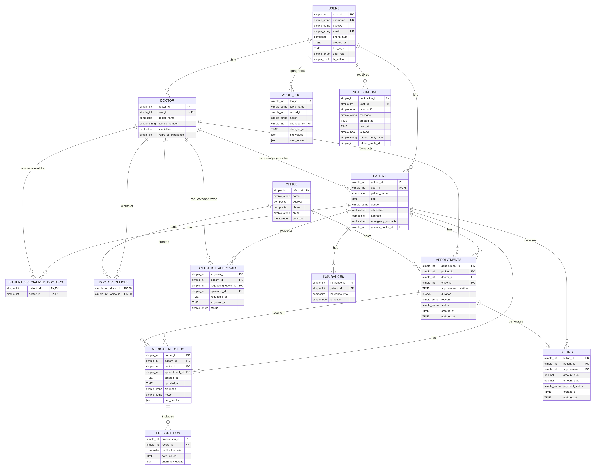

## Project Directory Structure
Medical-Clinic/
├── backend/
│   ├── node_modules/
│   ├── src/
│   │   ├── config/
│   │   ├── models/
│   │   ├── routes/
│   │   └── testDbConnection.js
│   ├── tests/
│   ├── package.json
│   ├── package-lock.json
│   └── server.js
├── frontend/
│   ├── node_modules/
│   ├── public/
│   │   ├── index.html
│   │   ├── manifest.json
│   │   └── robots.txt
│   ├── src/
│   │   ├── components/
│   │   ├── routes/
│   │   ├── styles/
│   │   ├── utils/
│   │   ├── index.jsx
│   │   └── reportWebVitals.js
│   ├── package.json
│   ├── package-lock.json
│   └── tailwind.config.js
├── database/
│   ├── migrations/
│   │   └── 0001_create_users_table.sql
│   └── scripts/
│       ├── create_dump.sh
│       ├── maketable.sh
│       ├── restore_from_dump.sh
│       └── syncdb.sh
├── docs/
│   └── ER_MedicalDB.png
├── scripts/
└── README.md

### Backend
contains the server-side code for handling API requests and responses using Node.js and a REST API
- /src: 
  - /config: Configuration files, like db connection settings.
  - /models: Defines the data models that correspond to db tables.
  - /routes: Defines the API endpoints and their corresponding handlers.
  - testDbConnection.js: util script to test the db connection.
- server.js: The main entry point for backend.

### Frontend
 client-side code for the UI using React.js and Tailwind CSS for styling, with React Router for site routing.
- /public: static files served directly to the client.
- index.html: main HTML entry point
- /src: 
  - /components: Reusable React components.
  - /routes: Components and logic related to different routes (pages) in website
  - /styles: Custom CSS or style-related files.
  - /utils: Util functions and helpers
- index.jsx: The main entry point for React

### Database
manages the db schema and data synchronization between ourselves locally using PostgreSQL
- /migrations: we will use this directory to sync our databases
- /scripts: utility scripts to create, restore, and sync the db